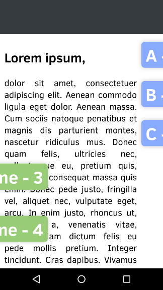
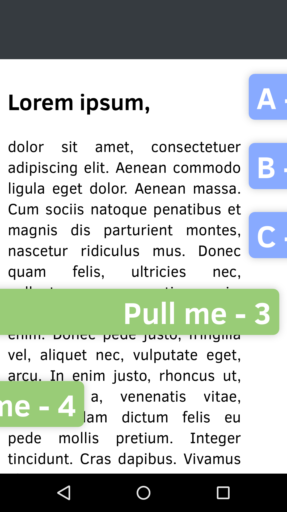

## ngDrawer

UI-Element for touch devices. Used to swipe, scroll, pull resp. draw content into view. 
ngDrawer respects the native scroll momentum. It will only work properly if the broswer hides the scrollbars.
Wont work with click and drag.

Drawn content will follow your fingertip just like scrolling content would do.
ngDrawer will not interfere with vertical scrolling.

Requires: AngularJs

* [Demo](http://prefr.org/static/ng-drawer/demo/demo.html) (use touch device)
* [Api Reference](http://prefr.org/static/ng-drawer/docs/index.html#/api)

