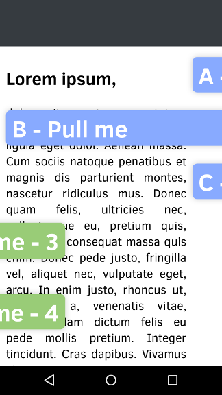
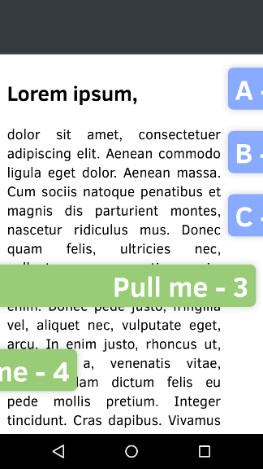

## ngDrawer

UI-Element for touch device. Used to swipe, scroll, pull resp. drawn content into view. 
ngDrawer respects the native scroll momentum. It will only work properly if the broswer hides the scrollbars.
Wont work with click and drag.

Drawn content will follow your fingertip just like scrolling content would do.

Requires: AngularJs

* [Demo](http://prefr.org/static/ng-drawer/demo/demo.html)
* [Api Reference](http://prefr.org/static/ng-drawer/docs/index.html#/api)

